# Bars4J - A simple, fast and effective way to include barcodes in java applications.
This project aims to create a java library (framework) for barcode creation. It is a revival of an old project I had at SourceForge, called JBarcode and now it has been renamed to Bars4J. The main features are support for a wide variety of standards, simplicity of including barcodes in Java applications and high performance with low memory consumption.

Barcodes Supported: EAN13, EAN8, UPCA, UPCE, Codabar, Code 11, Code 128, Code 39, Code 39 Extended, Code 93, Code 93 Extended, Standard 2of5, Interleaved 2of5, IATA 2of5, Datalogic 2of5, Matrix 2of5, MSI Plessey and PostNet.

## Simple and fast

To use the library just import the jar and follow the examples below:

Image Format:
```
...
//Creates a EAN13 barcode
Barcode b4j = BarcodeFactory.getInstance().createEAN13();
String code = "079357367940";
//Export as IMG
BufferedImage img = b4j.createBarcode(code);
...
```

SVG Format:
```
...
//Creates a Code128 barcode
Barcode b4j = BarcodeFactory.getInstance().createCode128();
String code = "Bars4J Code 128";
//Export as SVG
StringBuffer svg = b4j.createBarcodeSVG(code);
...
```

## SVG Barcode Samples

### EAN / UPC

| EAN13 | EAN8 | UPCA | UPCE |
|----------|:-------------:|:------:|------|
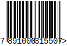 | 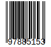 | 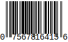 | 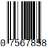 |

### Codes
| Code 39 | Code 39 Extended |
|----------|-------------|
|  | 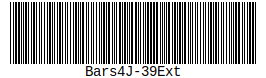 |

| Code 93 | Code 93 Extended |
|----------|-------------|
| 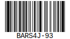 | 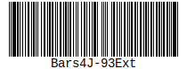 |

| Codabar | Code 11 | 
|----------|-------------|
| 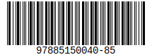 | 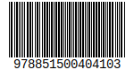 |

| Code 128 | MSI Plessey | 
|----------|-------------|
|  | 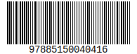 |

### ITF

| Standard 2of5 | Interleaved 2of5 |
|----------|-------------|
| 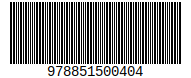 |  | 

| IATA 2of5 | Matrix 2of5 | Datalogic 2of5 |
|----------|-------------|----------|
| 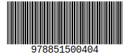 |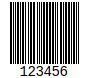 |  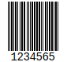 |

### PostNet

